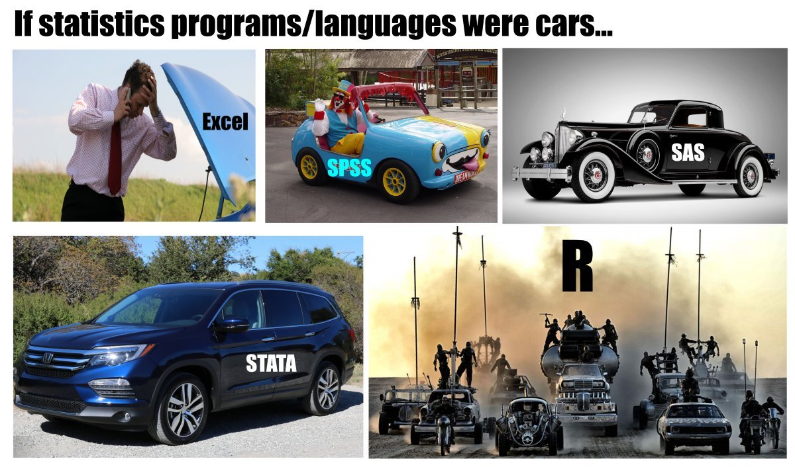

```{r setup, include=FALSE, echo=FALSE, warning=FALSE}
#| cache.extra: !expr tools::md5sum("_common.R")
options(htmltools.dir.version = FALSE)

# cache.extra above: this deck sets `cache: true`, and knitr's cache key is built
# from the CHUNK's code, not from files it sources. So editing the palette in
# _common.R left every cached figure drawing the OLD colors, silently -- and a
# chunk that referenced a NEWLY added constant failed with "object not found",
# because the cached setup environment predated it. Hashing the file into the
# key makes a palette edit invalidate the caches that depend on it.

# R starts in the C locale here, which cannot encode non-ASCII characters. Any
# Greek letter, minus sign, or +/- typed into a ggplot title, subtitle, axis
# label, or annotation gets drawn as the literal text <U+03B1>. Setting a UTF-8
# ctype fixes it for the whole document.
Sys.setlocale("LC_CTYPE", "en_US.UTF-8")

knitr::opts_chunk$set(fig.retina = 2, fig.align = "center",
                      warning = FALSE, error = FALSE, message = FALSE)

library(here)
library(tidyverse)
library(haven)
library(patchwork)
library(broom)
library(modelsummary)
library(kableExtra)

source("_common.R")   # Binghamton palette + theme_bu()

set.seed(20260916)

# First running data: Oneal & Russett democratic peace, dyad-year -- the same
# data we used for diagnostics last week, and the data Beck, Katz and Tucker
# used to make the argument this lecture is about
dp <- read_dta(here::here("data", "dp.dta"))
dp$lncaprat <- log(dp$caprat)   # a capability ratio is multiplicative, so model it on the log scale

# Second running data: leader-years built from Archigos, joined to Polity V. One
# row per year a leader held office; leftoffice marks the year the spell ends.
# The still-in-office spells are censored -- they had not ended when Archigos
# stopped collecting on 2015-12-31.
leaders <- read_csv(here::here("data", "leaderyears.csv"), show_col_types = FALSE) %>%
  mutate(leftoffice = if_else(exitreason == "Still in Office", 0L, leftoffice),
         yrborn = na_if(yrborn, -999),
         age    = year - yrborn) %>%
  arrange(obsid, year) %>%
  group_by(obsid) %>%
  mutate(t = row_number()) %>%          # survival time, within the spell
  ungroup()

polity <- read_csv(here::here("data", "p5v2018.csv"), show_col_types = FALSE) %>%
  dplyr::select(ccode, year, polity2)

lt <- leaders %>%
  left_join(polity, by = c("ccode", "year"), relationship = "many-to-one") %>%
  filter(!is.na(polity2), !is.na(age), entry != "Unknown") %>%
  mutate(region = factor(region, levels = c("Europe", "Americas", "Africa",
                                            "Middle East", "Asia/Oceania")),
         female = as.integer(gender == "F"),
         entry  = factor(entry, levels = c("Regular", "Irregular", "Foreign Imposition")),
         t2 = t^2, t3 = t^3)
```

<style>
table, th, td { font-size: 18px; }
tr:nth-child(odd) { background-color: #f2f2f2; }
</style>

# Goals

We've spent a lot of time on the binomial model predicting interstate disputes, but have not thought about the possibility that how long a dyad has been at peace might influence the value of the $y$ variable in the next period. Put differently, we haven't considered the possibility of "memory" across time. This week, we'll examine: 

- What would **memory** look like in a binary time-series setting, and why doesn't the logit have any?
- The concepts underneath hazard models: failure, survival, censoring, spells, and the **hazard rate**.
- The **discrete-time hazard model** — which turns out to be a logit you already know how to estimate, with one thing added to the right-hand side.

We continue using the @onealrussett97 democratic peace data. In part, this is for familiarity, using the same $y$, and mostly the same model as [last week's diagnostics deck](binaryextensions126.html). It is also the setting in which the discrete hazards argument was originally made: @becktuck built their case on these very data. Later in the slides, we'll apply the same machinery to a second dataset — leader tenure — where the spells are shaped somewhat differently.

# Temporal dependence

So far we have looked at binary-response models in terms of the log-likelihood, estimation, and interpretation. Today we relax an assumption every one of those models has made without saying so: **temporal independence**.

Temporal independence requires that $cov(\varepsilon_t, \varepsilon_{t-k}) = 0$ — that the errors are uncorrelated across time. It implies observations on $y$ are independent of one another. Put differently, the process generating $y$ is *memoryless*.

## Memory in models

In the linear model we had several ways of letting today's $y$ depend on the past — lagged $y$, lagged $x$. In the binary model we want the same kind of dynamics, but lagging $y$ does not quite do it. A lagged $y$ measures whether the *event* happened last period. What we actually want is how the latent probability that $y=1$ in the past bears on the probability $y=1$ today.

## The baseline model

Here is the model from last week, unchanged.

```{r baseline}
#| echo: true
#| code-fold: true
#| code-summary: "code"

dpm1 <- glm(dispute ~ border + deml + lncaprat + ally,
            family = binomial(link = "logit"), data = dp)

modelsummary(dpm1,
             stars = TRUE,
             coef_rename = c("border" = "Shared border",
                             "deml"   = "Min. democracy",
                             "lncaprat" = "Capabilities ratio (log)",
                             "ally"   = "Allied"),
             gof_omit = "RMSE|F",
             title = "The memoryless dispute model, Oneal-Russett dyad-years.",
             notes = "No measure of time appears anywhere in it.")
```

But here's a question this model can't answer: **What is the effect of democracy on a dyad that has been at peace for two years? For twenty-two?**

```{r flat-hazard}
#| echo: true
#| code-fold: true
#| code-summary: "code"
#| label: fig-flat
#| fig-height: 3.6
#| fig-alt: "Predicted probability of a dispute plotted against years since the last dispute, from zero to thirty-four. The line is perfectly flat at about 0.04 across the whole range, inside a narrow confidence band."

nd <- tibble(stime = 0:34, border = 0, deml = median(dp$deml),
             lncaprat = median(dp$lncaprat), ally = 0)

pred <- bind_cols(nd, predict(dpm1, newdata = nd, type = "link", se.fit = TRUE)) %>%
  mutate(p  = plogis(fit),
         lb = plogis(fit - 1.96 * se.fit),
         ub = plogis(fit + 1.96 * se.fit))

ggplot(pred, aes(stime, p)) +
  geom_ribbon(aes(ymin = lb, ymax = ub), fill = bu_greyfill, alpha = 0.7) +
  geom_line(color = bu_green, linewidth = 1) +
  scale_y_continuous(limits = c(0, 0.10)) +
  labs(title = "The memoryless model's answer",
       subtitle = "Two years at peace or twenty-two: the model says the same thing.",
       x = "Years since the last dispute", y = "Pr(dispute)") +
  theme_bu()
```

The prediction line over time is flat, and it is flat *by construction*. Time since the last dispute is not in the model, so it cannot matter: by exclusion, $\widehat{\beta}$ on time is fixed at zero. A dyad two years past a dispute and a dyad twenty-two years past one are treated as identical observations differing only in $X$.

Notice this is a choice we made in specifying the model. We assumed $y_t$ has no bearing on $y_{t+1}$ — no persistence, no memory from period to period. The rest of this lecture is about a class of models built to ask the question that assumption rules out: **how does having survived until now affect the chances of failing now?**

::: {.callout-note title="Where this connects to last week"}
The democratic peace data are panel data — cross-sections observed over time — and last week that structure caused us trouble. When we added dyad fixed effects, 621 of 827 dyads turned out never to experience a dispute, and every one of them was perfectly predicted by its own dummy. We treated that as a pathology, which it was. But it is also a *description of the data*: for most dyads, $y$ is a long string of zeros occasionally punctuated by a one. That structure is part of why it seems important to think about "memory" or "persistence" over time.
:::

# Hazards

The **hazard** is the probability of failure at a particular point in time, *conditional on having survived up until that point*. Asking about the chances that something ends without asking how long it has already lasted usually does not make much sense.

Consider human mortality as an example. All else equal:

- What is the probability of death for a 2-year-old?
- For a 22-year-old?
- For a 92-year-old?

It's possible (likely?) these probabilities are all similar because we're asking the wrong question. We're considering all these probabilities unconditionally even though a potentially important condition is that:

- The 2 year old has survived up until 2.
- The 22 year old has survived up until 22.
- The 92 year old has survived up until 92.

That conditional probability,

$$Pr(\text{Fail}_t \mid \text{Survival}_{t-1}),$$

is the **hazard rate**.

## Two ways to think about time

This invites us to think about how long the **spell** is a unit survives before it fails.

What do data on spells look like? There are two basic forms. 

Survival:

$$\text{Age} = 1, 2, 3, 4, 5, \ldots, 87, 88, 89$$

and failure:

$$\text{Death} = 0, 0, 0, 0, 0, \ldots, 0, 0, 1$$

These carry the two halves of the hazard — how many periods the unit survives, and the period in which it fails. They also correspond to the two families of hazard model. To keep them straight, ask yourself **what one row of your data is, and what the dependent variable on that row measures.**

**Continuous-time models: one row per spell, and $y$ is the survival time.** The leader is the row, and the $y$ variable is "held office for eleven years." That is the first vector above. We'll cover continuous-time models in November.

**Discrete-time models: one row per period, and $y$ is the failure indicator.** The leader-*year* is the row, and the $y$ variable is "did this leader leave office during this year — yes or no." That is the second vector, and because $y$ is binary we can estimate it with a binomial log-likelihood, which is to say with a logit.

So the same eleven-year tenure is one row in one setup and eleven rows in the other. That is a reshaping of the same facts, not two different studies, and the section on BTSCS data below is about how to do the reshaping.

### The process is continuous; the measurement is not

Here is the distinction - it's easy to confuse the two. Leaders do not leave office on the first of January. A leader can fall at any hour of any day, and a dispute can start on a Tuesday afternoon — **the process runs in continuous time.** But Archigos writes down a year, and Oneal and Russett write down a year, so **what we get to observe is an interval.** The process is continuous and the record is chunked.

Which means the choice between the two families is usually not a choice about the world. It is a choice about the data you were handed. If the record gives you exact dates, you can use them; if it gives you years, you have interval data whether you like it or not, and pretending otherwise does not make the information appear.

Two things follow.

**Wide intervals matter more when a lot happens inside them.** If the chance of failing in a period is small, it barely matters that we cannot see *where* in the period the failure fell. If the chance is large, it matters more. Our two datasets sit on either side of this: the annual chance of a dispute is about **4.5%**, while the annual chance of a leader losing office is about **19%** — four times higher.

**Chunked measurement produces ties, in bulk.** Because tenure is recorded in whole years, survival time takes very few distinct values, and enormous numbers of leaders share each one. In these data **2,996 exits are spread over just 46 distinct survival times — 65 leaders to a value on average, and 710 of them leaving in their very first year.** For a continuous-time model, these "ties" are a nuisance to be worked around, and in November we will see the approximations people use to do it. For a discrete-time model it is not a problem at all: grouped failures are what the model assumes in the first place. When the data come to you in years, the discrete-time model is the one that takes them at face value.

::: {.callout-note title="An aside on naming"}
Models like these are called hazard models, survival models, duration models, or event-history models more or less interchangeably. They all mean modeling the time until an event. The names sometimes signal which quantity is in view: the hazard is the probability of failure at $t$; survival is the probability of lasting *past* $t$. They are opposites. "Event history" usually signals discrete time.
:::

## What spells actually look like

@fig-spells-real shows spells in the dispute data (left panel) and the Archigos leader survival data (right panel). Notice that spells can end in two ways. The unit can fail by experiencing the event of interest (a dispute, leaving office), or the unit can survive through the end of the observation period - it is **censored**. Each bar is one
spell, starting at zero and running to the length we observe; a filled dot means the spell **ended** and a cross means it's **censored**.^[I used Claude code to generate Figures 2 and 13.]

```{r spells-real}
#| echo: true
#| code-fold: true
#| code-summary: "code"
#| label: fig-spells-real
#| fig-height: 4
#| fig-alt: "Two panels, eighteen horizontal bars each, one bar per spell, sorted short to long. Left panel: dyad spells measured in years since the last dispute. Right panel: leader spells measured in years in office. A filled dot at the right end of a bar marks a spell that ended in failure; a cross marks one still running when the data end."

set.seed(20260916)   # the spells below are a random draw; fix it so the figure is stable

pick <- function(d, nf, nc) bind_rows(
  d %>% dplyr::filter(fail == 1) %>% slice_sample(n = nf),
  d %>% dplyr::filter(fail == 0) %>% slice_sample(n = nc))

# the spell counter is built properly in a moment; here it is inline, from dp
dp_sp <- dp %>% arrange(dyad, year) %>%
  group_by(dyad) %>%
  mutate(prior = lag(dispute, default = 1), spell = cumsum(prior == 1)) %>%
  group_by(dyad, spell) %>%
  summarise(len = n() - 1, fail = as.integer(any(dispute == 1)), .groups = "drop") %>%
  pick(12, 6) %>% arrange(len) %>%
  mutate(row = row_number(), data = "Dyads: years since the last dispute")

lt_sp <- lt %>% group_by(obsid) %>%
  summarise(len = max(t), fail = max(leftoffice), .groups = "drop") %>%
  pick(12, 6) %>% arrange(len) %>%
  mutate(row = row_number(), data = "Leaders: years in office")

bind_rows(dp_sp %>% dplyr::select(row, len, fail, data),
          lt_sp %>% dplyr::select(row, len, fail, data)) %>%
  mutate(ending = if_else(fail == 1, "failed", "still running when the data end")) %>%
  ggplot(aes(y = row)) +
  geom_segment(aes(x = 0, xend = len, yend = row), color = bu_grey, linewidth = 1.8) +
  geom_point(aes(x = len, shape = ending, color = ending), size = 3) +
  facet_wrap(~ data, scales = "free") +
  scale_shape_manual(values = c("failed" = 16, "still running when the data end" = 4)) +
  scale_color_manual(values = c("failed" = bu_green, "still running when the data end" = bu_black)) +
  labs(title = "Eighteen spells from each dataset",
       subtitle = "Each bar is one spell. Filled dot: it ended. Cross: censored.",
       x = "Survival time (years)", y = NULL, shape = NULL, color = NULL) +
  theme_bu() +
  theme(legend.position = "bottom", axis.text.y = element_blank(),
        panel.grid.major.y = element_blank())
```

Three things to take from the picture.

**Every bar has exactly one ending**, and the whole modeling problem is that the two endings mean
different things. A dot at year three says "this one lasted three years and then failed." A cross at
year three says "this one lasted *at least* three years" — and we do not know how much longer it
would have gone. Throwing censored spells away loses the information they carry; treating them as failure events would mismeasure the event of interest.

**Censoring is not random with respect to length.** Notice the crosses cluster at the long end. That
is not an accident of the sample: a spell is censored precisely because it was still running when the
window closed, so long spells are the ones most likely to get caught by the edge of the data. Any
procedure that quietly drops or miscodes censored cases will therefore be wrong *about long spells in
particular*. Why are some short spells censored? Suppose a dyad fights, then is at peace for two years, but then the period of observation ends. Likewise, suppose a leader who takes office just a year before the period of study ends. In either case, the spell would be short and the case would be censored.

**A dyad can appear more than once; a leader cannot (really).** Each leader bar is one person's time in
office, and when it ends the leader is gone. While it's true some leaders leave and come back (e.g. Grover Cleveland), those are two distinct and discontinuous spells, as if they were two different leaders. The dyad bars are spells *between* disputes, so a single dyad contributes several of them over the period — one dyad in these data contributes 33. That is the repeated-events structure, and it is why the survival counter has to reset.

Notice the two panels do not use the same origin: the dispute data start at 0, the leader data at 1.
More on why below.

## BTSCS data

Binary $y$ observed for cross-sections over time is common enough in political science to have its own acronym: **Binary Time-Series Cross-Section** data. The democratic peace data are exactly this.

Two dyads may both be recorded as failing in year 3, but one almost certainly started its dispute before the other; we simply cannot see the difference. Because failures get grouped into intervals this way, BTSCS data are **grouped duration data**.

```{r btscs-table}
#| echo: true
#| code-fold: true
#| code-summary: "code"
#| label: tbl-btscs-table
#| tbl-cap: "BTSCS data: one row per dyad-year."

tibble(
  Dyad     = c(rep("US--Cuba", 11), rep("US--UK", 8)),
  Year     = c(1960:1970, 1960:1967),
  Dispute  = c(0,1,0,0,0,0,0,1,0,0,0,  0,0,0,0,0,0,0,0),
  Censored = c(0,0,0,0,0,0,0,0,0,0,1,  0,0,0,0,0,0,0,0)
) %>%
  kbl() %>%
  kable_styling("striped", full_width = FALSE, font_size = 16)
```

## Terminology

- A unit <span style="color:red;">**fails**</span> when it experiences the event of interest. In mortality studies that is death; here it is a militarized dispute.
- A unit is <span style="color:red;">**at risk**</span> until it exits the data, either because observation ends or because it fails and cannot fail again. A person dies once; a dyad can have many disputes, so the dyad remains at risk until the period of observation ends.
- A unit <span style="color:red;">**survives**</span> a spell up to the point it fails, and counting those periods gives <span style="color:red;">**survival time**</span>.
- The period a unit survives is a <span style="color:red;">**spell**</span>; spells end at failure or at censoring.
- In @tbl-btscs-table, we know nothing about these dyads before 1960 — they are <span style="color:red;">**left-censored**</span>. Likewise, in @tbl-btscs-table, we know nothing about these dyads after 1970 — any unit that has not failed by then is <span style="color:red;">**right-censored**</span>.

```{r spells}
#| echo: true
#| code-fold: true
#| code-summary: "code"
#| label: fig-spells
#| fig-height: 3.4
#| fig-alt: "Five horizontal bars, one per case, against a time axis running from -3 to 11 with the observation window t = 0 to t = 8 shaded. Each bar is labelled with its kind. Case 2 starts before the window opens (left censored); case 4 continues past where it closes (right censored); case 3 fails exactly at the last period; cases 1 and 5 begin and end inside the window."

# We observe t = 0 to t = 8 and nothing outside it. Two spells deliberately run
# past an edge: case 2 begins before 0, case 4 is still going after 8.
spells <- tibble(
  case  = 1:5,
  start = c(3.0, -2.0, 2.8,  3.5, 5.5),
  end   = c(6.0,  2.5, 8.0, 10.5, 7.0),
  kind  = c("uncensored", "left censored", "fails at last period",
            "right censored", "uncensored"))

ggplot(spells, aes(y = case)) +
  annotate("rect", xmin = 0, xmax = 8, ymin = -Inf, ymax = Inf,
           fill = "grey85", alpha = 0.5) +
  annotate("segment", x = c(0, 8), xend = c(0, 8), y = -Inf, yend = Inf,
           linetype = "dashed", color = "grey35", linewidth = 0.5) +
  annotate("text", x = 4, y = 5.8, label = "period of observation:  t = 0 to t = 8",
           hjust = 0.5, size = 3.2, color = "grey15") +
  geom_segment(aes(x = start, xend = end, yend = case, color = kind),
               linewidth = 2.2, lineend = "butt") +
  geom_text(aes(x = pmax(start, 0) + 0.15, label = kind), hjust = 0, vjust = -1.1,
            size = 3.0, color = "grey15") +
  scale_color_manual(values = c("uncensored" = bu_green,
                                "left censored" = bu_lightgreen,
                                "fails at last period" = bu_teal,
                                "right censored" = bu_black),
                     guide = "none") +
  scale_x_continuous(breaks = c(-2, 0, 2, 4, 6, 8, 10), limits = c(-3, 11.5)) +
  scale_y_continuous(breaks = 1:5, limits = c(0.5, 6.2)) +
  labs(title = "Five spells, and what we get to see of them",
       subtitle = "We see only t = 0 to 8 (shaded). Case 2 began before that window; case 4 outlived it.",
       x = "time", y = "case") +
  theme_bu()
```

The same data can be reshaped so that a row is a *spell* rather than a dyad-year. US--Cuba has three spells across eleven years at risk: two ending in disputes, and a third that simply runs out when our observation window closes.

```{r spell-table}
#| echo: true
#| code-fold: true
#| code-summary: "code"

tibble(
  Dyad     = c("US--Cuba", "US--Cuba", "US--Cuba", "US--UK"),
  Year     = c(1961, 1967, 1970, 1967),
  Fail     = c(1, 1, 0, 0),
  Censored = c(0, 0, 1, 1),
  Survival = c(2, 6, 3, 8)
) %>%
  kbl(caption = "The same data as spells. Survival times sum to time at risk.") %>%
  kable_styling("striped", full_width = FALSE, font_size = 16)
```

# The quantities

Write the probability of failing exactly at $t$ — the density:

$$f(t) = Pr(t_i = t)$$

The cumulative probability of having failed by $t$:

$$F(t) = \sum_{i=1}^{t} f(t_i)$$

The probability of surviving past $t$ is its complement, the **survivor function**:

$$S(t) = 1 - F(t) = Pr(t_i > t)$$

And the one we actually want — failing at $t$ *given* survival to $t$:

$$
\begin{aligned}
h(t) &= Pr(t_i = t \mid t_i \geq t)\\
     &= \frac{f(t)}{S(t-1)}
\end{aligned}
$$

The denominator is $S(t-1)$, not $S(t)$: the units at risk in period $t$ are the ones who got
*through* period $t-1$, which is what $S(t-1)$ counts. $S(t)$ has already removed the units that
fail at $t$ — the very ones the hazard is about.

This is the **hazard rate**, the probability of failure at $t$, given survival until $t$. It explicitly relates the past to the present, which is how memory gets into the model. $h(t)$ differs from $Pr(y_t = 1)$ precisely by conditioning on what came before $t$.

Two rearrangements we will need. The conditional probability of surviving a period is one minus the hazard,

$$Pr(t_j > t \mid t_j \geq t) = 1 - h(t),$$

so the survivor function is the product of surviving each period up to $t$:

$$S(t) = \prod_{j=0}^{t}\left\{1 - h(j)\right\}$$

and the density factors as

$$f(t) = h(t)\,S(t-1).$$

## A likelihood

Build a likelihood out of those parts — failures contribute $f(t)$, survivors contribute $S(t)$:

$$\mathcal{L} = \prod_{t_i \leq t} f(t_i) \prod_{t_i \geq t} S(t_i)$$

Now let $y_{i,t}$ indicate whether a unit fails during our observation window (1) or is censored (0), and use it as a switch:

$$\mathcal{L} = \prod_{t_i \leq t} f(t_i)^{y_{i,t}} \prod_{t_i \geq t} S(t_i)^{1 - y_{i,t}}$$

That should look familiar — it is the same construction as the Bernoulli log-likelihood, one term for each outcome (survival, failure), with the exponent selecting which one applies. Substituting $f(t) = h(t)S(t)$:

$$\mathcal{L} = \prod_{i=1}^{N} \Bigg\{h(t)\prod_{j=1}^{t-1}\left[1 - h(t-j)\right]\Bigg\}^{y_{i,t}} \Bigg\{\prod_{j=0}^{t-1}\left[1 - h(t-j)\right]\Bigg\}^{1 - y_{i,t}}$$

Pick a form for the hazard and you have a model. The exponential gives a constant hazard, $h(t) = \lambda$; the Weibull gives $h(t) = \lambda p(\lambda t)^{p-1}$, monotonic in $t$. We take those up with continuous time models in November. In discrete time we do something easier.

### Both families maximize this same likelihood

Go back to the two ways of writing time. The likelihood above looks like it belongs to the continuous-time family: it is written one term per *spell*, and survival time appears in it directly. So it's worth seeing why the discrete-time logit — which is written one row per *year*, with a 0/1 outcome — ends up maximizing the very same thing.

Take one leader who held office four years and then lost power. In person-period form that is four rows, and the model treats each as its own coin flip: did the spell end this year? Multiply the four probabilities together, since they are conditional on one another in sequence:

$$\underbrace{\left[1-h(1)\right]}_{\text{survived yr 1}} \times \underbrace{\left[1-h(2)\right]}_{\text{survived yr 2}} \times \underbrace{\left[1-h(3)\right]}_{\text{survived yr 3}} \times \underbrace{h(4)}_{\text{failed in yr 4}}$$

Now compare that with what the likelihood above asks for. A failure contributes $f(t) = h(t)S(t)$ — the chance of surviving to year four and then failing in it. **Those are the same expression.** The run of $[1-h(j)]$ terms *is* $S(t)$, and the last term is the hazard at failure. A censored leader — one still in office when the data stop — contributes only the run of survival terms, with no hazard on the end, which is exactly $S(t)$ on its own.

So the two families are not two models. They are **one likelihood, written two ways**, and each way keeps both halves of the story: survival time and failure. The continuous-time version puts survival time in the row and hides the failure indicator in the exponent; the discrete-time version puts the failure indicator in the row and hides survival time in *how many rows the spell gets*.

Why bother with the second one, then? Because of what the reshaping buys. A product over years becomes a sum over rows once we take logs, and a sum over rows with a binary outcome is precisely what a logit maximizes. **The discrete-time hazard model is not an approximation to a duration model — it is a duration model, laid out so that `glm` can estimate it.** That is the whole trick, and it is why the rest of this lecture can proceed with a tool you already know.

# Discrete-time hazards

Until the late 1990s, work on BTSCS data mostly ignored all of this: the conventional model was a plain logit, exactly like the memoryless dispute model above. @becktuck pointed out what was wrong with that, and proposed a fix simple enough that it became standard almost immediately.

**The problem.** A logit on these data assumes observations on $y$ arise independently — as if each dyad-year were its own Bernoulli trial, with no relationship between the outcome at $t$ and outcomes at $t-1, t-2, \ldots$. In the democratic peace context that means the chance of a dispute this year is unrelated to whether the dyad has been at peace for one year or for thirty. On its face that is a heroic assumption, and if it is wrong, the model is misspecified and the estimates are biased.

**The solution.** At its root, this is a specification problem: we think time since the last dispute matters, and no measure of it is in the model. So put one in. Beck, Katz, and Tucker suggest including **survival time** as a right-hand-side variable, and including nonlinear functions of it so the effect of time is not forced to be monotonic. They used survival time and cubic splines (nonlinear functions of survival time); @carter2010back later showed that polynomials in survival time do the same work and are far easier to compute and explain.

**The result.** Including survival time is now the state of the art, and it changes what the model's predictions mean. They are no longer unconditional probabilities. They are conditional on survival — that is, they are **hazards**. Most published BTSCS models include survival time; rather fewer interpret the quantities of interest correctly.

## Building survival time

The counter is a within-dyad row number that resets after every dispute.

```{r survival-time}
#| echo: true
#| code-fold: true
#| code-summary: "code"

survivaldp <- dp %>%
  arrange(dyad, year) %>%
  group_by(dyad) %>%
  # a new spell starts the year after a dispute; the first year of a dyad is
  # treated as though it followed one, since we cannot see before the window
  mutate(prior = lag(dispute, default = 1),
         spell = cumsum(prior == 1)) %>%
  group_by(dyad, spell) %>%
  mutate(stime = row_number() - 1) %>%
  ungroup() %>%
  dplyr::select(-prior, -spell) %>%
  mutate(stime2 = stime^2, stime3 = stime^3)

survivaldp %>%
  filter(dyad == first(dyad)) %>%
  dplyr::select(dyad, year, dispute, stime) %>%
  head(20) %>%
  kbl(caption = "Survival time in the democratic peace data: the counter resets at each dispute.") %>%
  kable_styling("striped", full_width = FALSE, font_size = 16)
```

Survival time runs from 0 to 34 years, averaging 11.5. About 8% of dyad-years sit at `stime == 0`, the year immediately after a dispute.

## Visualizing the risk set, $h(t)$, and $S(t)$

We've seen the definitions of $f(t)$, $S(t)$ and $h(t)$, but they're also things we can construct pretty easily really by counting. This will help make the ideas more concrete.

We'll build them on the leader data first, where a unit fails once and the arithmetic is easy to
follow. The next section runs the same four lines on the dispute data, where units can fail more
than once.

### Computing the quantities

Four steps. Each one produces a column in the table below, and the code folded under each figure
*is* that step. I've truncated the figures at 25 years just for presentation; a few spells run longer.

**1. Group the person-period rows by survival time $t$.** Every leader-year with $t=3$ goes in one
group, every leader-year with survival time of $t=4$ in the next.  We are sorting rows by
how long the spell had already run when the row was recorded. One bar per group, and the height is
how many rows fell into it:

```{r step1}
#| echo: true
#| code-fold: true
#| code-summary: "code"
#| label: fig-step1
#| fig-height: 2.4
#| fig-alt: "Bar chart of leader-years at risk against years in office, 1 to 25. The bars fall steeply and monotonically: the first year holds several thousand leader-years and the count drains to a few hundred by year 25."

ggplot(dplyr::filter(lt, t <= 25), aes(t)) +
  geom_bar(fill = bu_lightgreen, color = bu_green) +
  labs(title = "Step 1: leader-years at risk",
       x = "Years in office (t)", y = "leader-years") +
  theme_bu()
```

**2. Count the rows in each group. That is the risk set at $t$** — the units that survived to $t$
and could still fail there. It is the denominator of the hazard: the $S(t-1)$ in $h(t) = f(t)/S(t-1)$,
written as a count instead of a probability. In person-period data you get it by counting rows,
because a leader who left office in year three *has no row for year four* — the spell is over, so it
stops generating rows. Same for a censored leader: the data stop, so the rows stop. That count is
the `at_risk` column in the table below, and @fig-step1 already draws it — the height of each bar is
the number of leader-years that reached $t$ and could still fail there.

**3. Sum the failures in each group, and divide.** Failures over rows at risk is $\hat h(t)$ — of
those who reached year $t$, the share who left during it. This is the definition we wrote earlier,

$$h(t) = Pr(t_i = t \mid t_i \geq t),$$

with counts standing in for probabilities: the numerator counts the units that failed *at* $t$, the
denominator counts everyone who made it *to* $t$. The denominator is what makes this conditional since it counts only the units that were still around at $t$. These are the `failures` and `h` columns in
the table. 

```{r step3}
#| echo: true
#| code-fold: true
#| code-summary: "code"
#| label: fig-step3
#| fig-height: 2.4
#| fig-alt: "Bar chart of the empirical hazard, failures divided by units at risk, against years in office, 1 to 25. The bars sit around 0.2 and decline gently across the range, staying substantial throughout with no collapse."

lt %>%
  group_by(t) %>%
  summarise(h = mean(leftoffice), .groups = "drop") %>%   # failures / rows at risk
  dplyr::filter(t <= 25) %>%
  ggplot(aes(t, h)) +
  geom_col(fill = bu_lightgreen, color = bu_green, width = 0.7) +
  labs(title = "Step 3: h(t) = failures / units at risk",
       x = "Years in office (t)", y = "h(t)") +
  theme_bu()
```

**4. Take the running product of the complements.** $1 - \hat h(t)$ is the share who got through
year $t$ having reached it, so multiplying them from the first year on gives $\hat S(t)$, the share
who got through all of them. That is the other formula we wrote earlier,

$$S(t) = \prod_{j=0}^{t}\left\{1 - h(t-j)\right\},$$

done arithmetically. These are the `one_minus_h` and `S` columns. One
line more than step 3 — the `cumprod()`:

```{r step4}
#| echo: true
#| code-fold: true
#| code-summary: "code"
#| label: fig-step4
#| fig-height: 2.4
#| fig-alt: "Step plot of the survivor function against years in office, 1 to 25. It starts near one and falls steadily, dropping below 0.5 in the early years and reaching roughly 0.03 by year 25."

lt %>%
  group_by(t) %>%
  summarise(h = mean(leftoffice), .groups = "drop") %>%
  mutate(S = cumprod(1 - h)) %>%                          # chain the complements
  dplyr::filter(t <= 25) %>%
  ggplot(aes(t, S)) +
  geom_step(color = bu_green, linewidth = 0.9) +
  labs(title = "Step 4: S(t), the running product of (1 - h)",
       x = "Years in office (t)", y = "S(t)") +
  theme_bu()
```

Let's follow these four steps and compute the six quantities below. Doing so is straightforward,
using `group_by()`, `summarise()`, one division, and `cumprod()`.

```{r emp-worked}
#| echo: true
#| code-fold: true
#| code-summary: "code"

emp_lt <- lt %>%
  group_by(t) %>%                                            # step 1
  summarise(at_risk = n(),                                   # step 2
            failures = sum(leftoffice), .groups = "drop") %>%
  mutate(h = failures / at_risk,                             # step 3
         one_minus_h = 1 - h,
         S = cumprod(one_minus_h))                           # step 4

emp_lt %>%
  head(6) %>%
  mutate(across(h:S, ~ round(.x, 3))) %>%
  kbl(caption = "The hazard and survivor functions, by counting. Leader-years, first six years of tenure.") %>%
  kable_styling("striped", full_width = FALSE, font_size = 16)
```

Let's work through the first two rows. 3,134 leader-years sit at $t=1$, and 710 of those leaders left
during their first year, so $\hat h(1) = 710/3134 = 0.227$ and $\hat S(1) = 1 - 0.227 = 0.773$. Of
the 2,424 who reached a second year, 620 went, so $\hat h(2) = 620/2424 = 0.256$ — and the share
surviving *two* years is $0.773 \times 0.744 = 0.576$. Notice the risk set fell from 3,134 to 2,424:
the 710 who failed are gone. From year two to year three it falls by 646 while only 620 failed; the
other 26 are spells that stop without failing — censored, or leader-years the Polity join dropped.

This is the discrete-time cousin of the Kaplan–Meier estimator, and it is what a hazard model is
trying to describe. It has no covariates in it, which is both its virtue — nothing can be
mis-specified — and its limit, since it cannot tell you what democracy does. That is what the models
are for. But it gives us a picture of the thing being modeled, and something to check a model
against.

Three things to take from the figures.

**The risk set drains over time** (@fig-step1). We start with 3,134 leader-years at $t=1$ and are down to 78
by year 25. Units leave the risk set by failing *or* by being censored, and either way they stop
contributing. This is why hazard estimates get noisy at long survival times — not because the model
is bad, but because by then there is almost nobody left to learn from. Any confidence band you see
widening out to the right is telling you about this picture.

**The hazard is not monotonic** (@fig-step3). The first eight years run 0.23, 0.26, 0.18, 0.17, 0.26,
0.23, 0.19, 0.10: **high, and wandering.** The riskiest year of the eight is the fifth, not the
first, and the series goes up and down twice before it starts falling in earnest. Whatever is going
on in leader tenure, "risk decays with time survived" is not a fair summary of it.

**$S(t)$ chains the hazards over time** (@fig-step4). Multiply the complements and you get the share still
surviving: about 58% of leaders make it through two years, 47% through three, and only about 3% are
still in office 25 years on.

None of this involved a model. That matters twice over: it means the hazard is a real feature of
data rather than an artifact of a specification, and it gives us something to check a model
*against* — which we do as soon as we have one.

## The same quantities for the dispute data

The leader data are the simple case: a leader takes office once, leaves once, and the spell is
over. Dyads are not like that. The United States and Russia can have a dispute, settle, stay
quiet for years, and have another one — and in these data they do that repeatedly. Two things
change before we run the recipe again.

**Units fail more than once, so the clock restarts.** We do not follow a dyad across the whole
window as a single spell. Every dispute ends a spell, and the year after it begins a new one with
the counter back at the start. That is what the `cumsum()` in the survival-time code was doing.
The 827 dyads here generate **1,735 spells**; 203 dyads contribute more than one, and the
US–Russia dyad alone contributes 33 — its clock restarts 32 times. So the risk set at $t$ counts
*spells* that reached $t$, not dyads. The leader data do the same thing in a less obvious way: a
leader who returns to office gets a new Archigos id, and the clock starts over.

**The counter starts at 0, not 1.** 

### Why leaders start at 1 and disputes start at 0

The two counters measure different things.

- The leader counter is **time in office, counting the current year**. A leader's first year is
  year 1. There is no year 0, because every leader in the data occupies a first year — the clock
  starts when they take office, and taking office is not a failure.
- The dyad counter is **years of peace already banked before the current one** — @becktuck's "peace
  years." The clock here is started *by* a failure, and the year immediately after a dispute has no
  full year of peace behind it. So it is 0. At $t=1$ one year of peace has elapsed, at $t=2$ two,
  and so on.

Two consequences. First, a clock that gets restarted by failures needs a value meaning "just
failed," and that value is 0. It is also where most of the failures are: 593 of the 1,735 spells
fail at $t=0$. Second, every dyad's *first observed* year is coded 0 too. The code sets
`lag(dispute, default = 1)`, which treats the start of the window as though a dispute had just
happened. We cannot see before 1951, so we assume the clock was just reset. This is a lousy assumption. A better practice would be to count back to the last dispute prior to 1951 (and many scholars do this since the dispute data are readily available back to 1815).

Starting at zero versus one does not change the model. A cubic in $t$ is also a cubic in $t+1$ — shifting the origin
is absorbed by the polynomial's coefficients, and the fit is identical. What it changes is how you
*read* the numbers: "the hazard at $t=1$" means a leader's first year in office,
but a dyad's second year of peace.

### Doing the counting

Nothing about the code changes except variable names. Group by `stime` instead of `t`, and sum
`dispute` instead of `leftoffice`:

```{r emp-dp}
#| echo: true
#| code-fold: true
#| code-summary: "code"

emp_dp <- survivaldp %>%
  group_by(t = stime) %>%
  summarise(at_risk = n(), failures = sum(dispute), .groups = "drop") %>%
  mutate(h = failures / at_risk,
         one_minus_h = 1 - h,
         S = cumprod(one_minus_h))

emp_dp %>%
  head(6) %>%
  mutate(across(h:S, ~ round(.x, 3))) %>%
  kbl(caption = "Dispute data. Dyad spells, first six years of peace.") %>%
  kable_styling("striped", full_width = FALSE, font_size = 16)
```

```{r empirical-dp}
#| echo: true
#| code-fold: true
#| code-summary: "code"
#| label: fig-empirical-dp
#| fig-height: 6.5
#| fig-alt: "Three stacked panels against years of peace, 0 to 25, for the dyad data. Top: spells still at risk, falling from about 1,735 to 275. Middle: the empirical hazard, which starts at 0.34, drops to 0.06 in a single step, then grinds below 0.02 and stays flat. Bottom: the survivor function, which falls sharply in the first two years and then flattens near 0.44."

emp_dp25 <- emp_dp %>% dplyr::filter(t <= 25)

d_risk <- ggplot(emp_dp25, aes(t, at_risk)) +
  geom_col(fill = bu_lightgreen, color = bu_green, width = 0.7) +
  labs(title = "Still at risk: the denominator", x = NULL, y = "spells") + theme_bu()

d_haz <- ggplot(emp_dp25, aes(t, h)) +
  geom_col(fill = bu_lightgreen, color = bu_green, width = 0.7) +
  labs(title = "h(t) = failures / at risk", x = NULL, y = "h(t)") + theme_bu()

d_surv <- ggplot(emp_dp25, aes(t, S)) +
  geom_step(color = bu_green, linewidth = 0.9) +
  labs(title = "S(t): the running product of (1 - h)",
       x = "Years of peace", y = "S(t)") + theme_bu()

d_risk / d_haz / d_surv
```

You can see the hazard is shaped nothing like the hazard from the leaders data. It's
$593/1735 = 0.342$ in the year right after a dispute and $64/1120 = 0.057$ the year after that —
barely a sixth the size, in a single step — then it grinds down under 0.02 and stays there. Disputes
beget disputes, and the danger passes quickly. Because the hazard collapses so fast, $S(t)$ flattens
early: about 44% of spells are still at peace 25 years on, against 3% of leaders still in office.
The risk set drains here too, from 1,735 spells to 275, so as with the leader data, we'd expect wider confidence intervals as we move further out on survival time.


:::: {.callout-note title="Important point"}
All of this rests on knowing our data extremely well, and on telling the software exactly what we
know. R cannot intuit what these rows mean. It cannot tell that `obsid` is a spell while `leadid` is
a person, that the counter restarts after every dispute but never after a leader takes office, that
a zero on the last row of a spell is a censored case rather than a survival, or that one dyad
contributes 33 spells. We have to say all of it: what the unit is, what time is counted from, what
counts as a failure, whether units can fail more than once, and which spells are censored.

That is both the power of these models and the burden of using them. The power is that the structure
carries real information — the risk set, the censoring, the restarting clock — and the model puts it
to work. The burden is that we supply the structure by hand and nothing checks us. Get it wrong and
the estimates still come back, with standard errors, looking perfectly reasonable. When the data
structure is not specified carefully, these models lose their meaning fast.
::::

## Three baseline hazards

The three models below differ only in how much freedom the baseline hazard has.

**Constant.** With no time term, the baseline hazard is a single number:

$$h_0(t) = \frac{1}{1 + \exp(-\beta_0)}$$

and the $x$ variables shift everything around that constant. This is the memoryless dispute model, and it is the flat line in @fig-flat.

**Monotonic.** Add the survival counter and the baseline can rise or fall, but only in one direction:

$$h_0(t) = \frac{1}{1 + \exp[-(\beta_0 + \gamma_0 t)]}$$

**Non-monotonic.** Add $t^2$ and $t^3$ and the baseline is free to fall, flatten, and rise again:

$$h_0(t) = \frac{1}{1 + \exp[-(\beta_0 + \gamma_0 t + \gamma_1 t^2 + \gamma_2 t^3)]}$$

The other two are special cases of this one: set $\gamma_1 = \gamma_2 = 0$ and the baseline is monotonic; set all three $\gamma$s to zero and it is constant. This is a close approximation to a Cox proportional-hazards model: it nests the constant (exponential) and monotonic (Weibull) hazards, it is very general, and it is trivial to estimate.

```{r hazard-models}
#| echo: true
#| code-fold: true
#| code-summary: "code"

h_const <- glm(dispute ~ border + deml + lncaprat + ally,
               family = binomial(link = "logit"), data = survivaldp)
h_mono  <- glm(dispute ~ stime,
               family = binomial(link = "logit"), data = survivaldp)
h_cubic <- glm(dispute ~ stime + stime2 + stime3,
               family = binomial(link = "logit"), data = survivaldp)
h_full  <- glm(dispute ~ stime + stime2 + stime3 + border + deml + lncaprat + ally,
               family = binomial(link = "logit"), data = survivaldp)

modelsummary(list("constant, with X" = h_const, "monotonic" = h_mono,
                  "cubic" = h_cubic, "cubic + X" = h_full),
             stars = TRUE,
             coef_rename = c("stime" = "Survival time", "stime2" = "Survival time^2",
                             "stime3" = "Survival time^3", "border" = "Shared border",
                             "deml" = "Min. democracy",
                             "lncaprat" = "Capabilities ratio (log)", "ally" = "Allied"),
             gof_omit = "RMSE|F",
             title = "Dispute models: four baseline hazards, Oneal-Russett dyad-years.")
```

Take a look at the second column. **Survival time alone — one variable, two parameters — fits these data far better than all four substantive covariates together.** Log-likelihood $-3102$ against $-3507$; AIC $6208$ against $7024$. Those two models are not nested — neither is a restricted version of the other — so this is an AIC comparison, not a likelihood-ratio test.

The nested comparison we *can* test is the last column against the first: the cubic baseline added to the same four covariates.

```{r dispute-lrt}
#| echo: true
#| code-fold: true
#| code-summary: "code"

# Cubic baseline against constant baseline, same covariates in both.
anova(h_const, h_full, test = "LRT")
```

$\chi^2 = 1663.1$ on 3 degrees of freedom, and the log-likelihood moves from $-3507$ to $-2676$. Three survival-time terms do a great deal of work in a model that already has the four substantive covariates in it.

## The baseline hazards

The baseline hazards are approximately the constant-only models - they include just the constant and the survival time indicators. The first panel is literally constant only; the second includes survival time; the third includes survival time and its polynomials.

```{r hazard-shapes}
#| echo: true
#| code-fold: true
#| code-summary: "code"
#| label: fig-shapes
#| fig-height: 4.2
#| fig-alt: "Three side-by-side panels, one per baseline specification, each plotting the hazard against years since the last dispute with a confidence band. Constant: a flat line near 0.04. Monotonic: a line declining smoothly across the whole range. Cubic plus covariates: starts near 0.25, falls to 0.14 by year two and 0.02 by year five, bottoms out near 0.007 around year ten, then drifts slightly up."

grid <- tibble(stime = 0:34) %>%
  mutate(stime2 = stime^2, stime3 = stime^3,
         border = 0, deml = median(survivaldp$deml),
         lncaprat = median(survivaldp$lncaprat), ally = 0)

haz <- function(m, lab) {
  p <- predict(m, newdata = grid, type = "link", se.fit = TRUE)
  tibble(model = lab, stime = grid$stime,
         h  = plogis(p$fit),
         lb = plogis(p$fit - 1.96 * p$se.fit),
         ub = plogis(p$fit + 1.96 * p$se.fit))
}

bind_rows(haz(h_const, "constant"), haz(h_mono, "monotonic"), haz(h_full, "cubic + X")) %>%
  mutate(model = factor(model, levels = c("constant", "monotonic", "cubic + X"))) %>%
  ggplot(aes(stime, h)) +
  geom_ribbon(aes(ymin = lb, ymax = ub), fill = bu_greyfill, alpha = 0.7) +
  geom_line(color = bu_green, linewidth = 0.9) +
  facet_wrap(~ model) +
  labs(title = "Three baseline hazards, Democratic Peace dispute data",
       subtitle = "Letting the baseline vary changes what the model says about time.",
       x = "Years since the last dispute", y = "h(t): Pr(dispute | survived to t)") +
  theme_bu()
```

The cubic hazard starts at about **0.25** in the year right after a dispute, falls to **0.14** by the next year and **0.02** by year five, bottoms out near **0.007** around year ten, and drifts back up slightly after that. That shape is what the model is telling us: **disputes beget disputes, and the risk decays fast.** A model without time reports a flat 4% for all of it, which is close to right on average and wrong nearly everywhere.

## Covariates as shifts of the baseline

With the baseline free to vary, the $x$ variables are deviations from it. Here is democracy, at three values - these are average effects plotted across survival time. Note the y-axis is labeled h(t) - still just a logit model and the same prediction we've learned to generate, but because we're computing the probability of failure **given** survival, this is now the hazard rate of disputes. 

```{r deml-hazard}
#| echo: true
#| code-fold: true
#| code-summary: "code"
#| label: fig-deml
#| fig-height: 4
#| fig-alt: "Three hazard curves plotted against years since the last dispute, 0 to 34, one per value of minimum democracy (-10, 0, +10), each with a confidence band and its own dash pattern. All three share the same shape: high in the first two years, then a rapid decline to near zero by year ten. In the earliest years the least democratic curve sits about two and a half times above the most democratic one; by year ten the three are indistinguishable."

esample <- survivaldp %>% drop_na(dispute, stime, border, deml, lncaprat, ally)

bh <- coef(h_full)
Vh <- vcov(h_full)

# The quantity is the AVERAGE hazard at (deml, t): one number, a function of
# beta-hat. Its gradient is the average of the case-level gradients, so the
# delta method gives its standard error directly. Averaging the case-level
# standard errors instead would describe a typical dyad, not the average -- and
# a symmetric band on the probability scale runs below zero once the hazard is
# near the floor, so bound the linear predictor and transform the end points.
avg_hazard <- function(d_value) {
  map_dfr(0:34, function(t) {
    nd <- esample %>% mutate(deml = d_value, stime = t, stime2 = t^2, stime3 = t^3)
    X  <- model.matrix(formula(h_full)[-2], data = nd)
    xb <- as.vector(X %*% bh)
    hbar <- mean(plogis(xb))
    g  <- colMeans(sweep(X, 1, dlogis(xb), "*"))
    se <- sqrt(as.numeric(t(g) %*% Vh %*% g))
    tibble(deml = d_value, stime = t, h = hbar,
           lo = plogis(qlogis(hbar) - 1.96 * se / (hbar * (1 - hbar))),
           hi = plogis(qlogis(hbar) + 1.96 * se / (hbar * (1 - hbar))))
  })
}

hd <- map_dfr(c(-10, 0, 10), avg_hazard) %>%
  mutate(democracy = factor(deml, levels = c(-10, 0, 10),
                            labels = c("least democratic (-10)", "middle (0)",
                                       "most democratic (10)")))

ggplot(hd, aes(stime, h, color = democracy, fill = democracy, linetype = democracy)) +
  geom_ribbon(aes(ymin = lo, ymax = hi), alpha = 0.45, color = NA) +
  geom_line(linewidth = 0.9) +
  scale_color_manual(values = c(bu_black, bu_lightgreen, bu_green)) +
  scale_fill_manual(values = c(bu_black, bu_lightgreen, bu_green)) +
  # the dash pattern repeats what the color says, so the three curves stay
  # separable in greyscale, on a washed-out projector, and for a reader with a
  # color vision deficiency (WCAG 1.4.1)
  scale_linetype_manual(values = bu_lty[1:3]) +
  labs(title = "Democracy shifts the baseline hazard up and down",
       subtitle = "Average effects: every case set to each value of democracy, at each survival time.",
       x = "Years since the last dispute", y = "h(t)",
       # all three of color/fill/linetype must be NULL-titled or ggplot draws
       # the redundant aesthetic as a SECOND legend instead of merging it in
       color = NULL, fill = NULL, linetype = NULL) +
  theme_bu()
```

Look at what the three curves do. They share a shape, and democracy moves them up or down — that is what "proportional hazards" means - this is an important feature of many hazard models and we'll address it later in the semester.

You can see the hazard for all three types of regimes declines rapidly after the first couple of years without a dispute. By year 10, there's practically no chance of dispute, and no difference based on regime. But in the first couple of years, not only are the hazards higher, the hazard for the least democratic dyad is 2.5 times higher than the hazard for a democratic pair of states. 

The model specification also matters for the coefficient we estimate. Democracy's estimate moves from $-0.070$ in the memoryless model to $-0.055$ once we include survival time — about a fifth of the apparent democratic-peace effect was time dependence being attributed to democracy.


# Modeling leader tenure

Everything above was built on dyad-years, where a dyad fights, makes peace, and can fight again.
That is a **repeated-events** setting, and it is why the survival counter had to reset: one dyad
contributes several spells. Plenty of processes do not work that way. A leader leaves office once,
and the spell is over — there is nothing to reset.

So take the same machinery to leader tenure. The data are leader-years built from Archigos
[@goemans2009archigos]: one row per year a leader held office, and `leftoffice` marking the year the
spell ends. The regime measure is `polity2` from Polity V, available at [Center for Systemic Peace](https://www.systemicpeace.org/inscrdata.html). Two features to notice before any model.

**Censored observations.** 168 leaders were still in power when Archigos stopped
collecting on 31 December 2015. Their spells have not ended; we simply stopped watching. Those
leader-years belong in the risk set with `leftoffice = 0`, exactly like the right-censored case in
@fig-spells. Code them as exits and you manufacture 168 failures that never happened.

**Survival time counts within the spell, not within the leader.** The spell identifier is `obsid`;
`leadid` identifies the *person*. There are 3,409 spells among 2,802
leaders, so 457 people held office more than once, and grouping by the person joins their separate
spells into one long tenure — counting the years they were out of office as though they were in it.

```{r leader-stime}
#| echo: true
#| code-fold: true
#| code-summary: "code"

lt %>%
  filter(obsid %in% c("USA-1961", "USA-1963")) %>%
  dplyr::select(obsid, leader, year, t, leftoffice, exitreason) %>%
  kbl(caption = "Leader-years: survival time restarts with each spell, and the exit lands on the last row.") %>%
  kable_styling("striped", full_width = FALSE, font_size = 16)
```

Now the same three baselines, on the same specification we would use without any of this.

```{r leader-models}
#| echo: false
#| # HIDDEN (2026-09-19): this is Exercise #5, Part II/III. `code-fold` is NOT
#| # hiding -- folded code ships in the HTML, in view-source, and in search.json,
#| # where "leftoffice" was turning up in five public search entries. Only
#| # `echo: false` keeps it off the page. The OUTPUT still renders, which is the
#| # part students need; the dyad-side chunks stay visible because those teach
#| # the technique on data that is not the assignment.

l_const <- glm(leftoffice ~ polity2 + age + female + entry + region,
               family = binomial(link = "logit"), data = lt)
l_mono  <- glm(leftoffice ~ t + polity2 + age + female + entry + region,
               family = binomial(link = "logit"), data = lt)
l_cubic <- glm(leftoffice ~ t + t2 + t3 + polity2 + age + female + entry + region,
               family = binomial(link = "logit"), data = lt)

modelsummary(list("constant" = l_const, "monotonic" = l_mono, "cubic" = l_cubic),
             stars = TRUE,
             coef_rename = c("t" = "Survival time", "t2" = "Survival time^2",
                             "t3" = "Survival time^3", "polity2" = "Polity",
                             "age" = "Leader age", "female" = "Female",
                             "entryIrregular" = "Irregular entry",
                             "entryForeign Imposition" = "Foreign imposition"),
             coef_omit = "region", gof_omit = "RMSE|F",
             fmt = fmt_significant(3),
             title = "Leader survival models: three baseline hazards, Archigos leader-years.",
             notes = "Regional fixed effects estimated, not shown. Baseline: Europe.")
```

The time terms are jointly a large improvement — a likelihood-ratio test of the cubic against the
constant baseline gives $\chi^2 = 138.2$ on 3 degrees of freedom — but look at what happens to the
covariates. **Polity falls from $0.054$ to $0.039$,
about 28%, and leader age rises from $0.0159$ to $0.0221$, about 38%.**

```{r leader-lrt}
#| include: false
#| # `include: false`, NOT `echo: false` -- and the difference is the whole point.
#| # `anova()` PRINTS BOTH MODEL FORMULAS in its Analysis of Deviance table, so
#| # hiding the code still published
#| #   Model 1: leftoffice ~ polity2 + age + female + entry + region
#| #   Model 2: leftoffice ~ t + t2 + t3 + polity2 + age + female + entry + region
#| # which is the answer to Exercise #5 Q5, in the OUTPUT. Nothing is lost by
#| # suppressing it: the prose above already quotes chi-sq = 138.2 on 3 df, and
#| # `dispute-lrt` shows the full deviance table on the DYAD data, which teaches
#| # the technique without being the assignment.
#| # Lesson for the next deck: check what a result PRINTS, not just what the
#| # chunk shows. anova(), summary(), and print.glm all echo the formula.

# The likelihood-ratio test quoted above: cubic baseline against constant.
anova(l_const, l_cubic, test = "LRT")
```

Age is the instructive one. Age and tenure are correlated by construction — a leader gets a year
older for every year in office — so in a model with no measure of tenure, `age` is measuring two
things at once, and doing a poor job of both. Part of its coefficient is the effect of being an
older person; part of it is the effect of having been in office a while. The two work against each
other: older leaders are more likely to go, while leaders who have already survived several years
are less likely to. And the longer a leader has been in office, the more of their age is tenure
rather than the age they arrived with — so the more age stands in for survival time, and the more
its own effect is diminished. That is the $0.0159$ in the constant-baseline model.

Adding survival time separates the two. Tenure gets its own terms, age is left with its own effect,
and the estimate rises to $0.0221$. The general point: whenever a covariate is mechanically
correlated with time in the spell, leaving the baseline hazard unmodeled makes that covariate absorb
the duration dependence instead.

## Comparing hazards: Leaders and Disputes

```{r compare-shapes}
#| echo: true
#| code-fold: true
#| code-summary: "code"
#| label: fig-two-shapes
#| fig-height: 3.6
#| fig-alt: "Two panels with independent y-axes, both plotting a fitted cubic hazard against survival time, 0 to 25. Left, dyads: the hazard collapses from about 0.25 to 0.02 by year five and 0.007 by year ten. Right, leaders: it decays gently from 0.22 to 0.19 at year five, 0.16 at ten, and 0.08 at twenty-five."

dp_shape <- tibble(stime = 0:25) %>%
  mutate(stime2 = stime^2, stime3 = stime^3, border = 0,
         deml = median(survivaldp$deml), lncaprat = median(survivaldp$lncaprat), ally = 0) %>%
  mutate(h = plogis(predict(h_full, newdata = .)), data = "Dyads: time to next dispute")

lt_shape <- map_dfr(1:25, function(tt) {
  d <- lt %>% mutate(t = tt, t2 = tt^2, t3 = tt^3)
  tibble(stime = tt, h = mean(predict(l_cubic, newdata = d, type = "response")))
}) %>% mutate(data = "Leaders: time to leaving office")

bind_rows(dp_shape %>% dplyr::select(stime, h, data), lt_shape) %>%
  ggplot(aes(stime, h)) +
  geom_line(color = bu_green, linewidth = 0.9) +
  facet_wrap(~ data, scales = "free_y") +
  labs(title = "The same model, two different baselines",
       subtitle = "Both are cubic in survival time; the data decide the shape.",
       x = "Survival time", y = "h(t)") +
  theme_bu()
```

Both hazards fall, and the way they fall is completely different. The dyad hazard **collapses**: a
quarter in the year after a dispute, 2% by year five, and 0.7% by year ten — a thirty-seventh of
where it started. The leader hazard **decays gently and stays substantial**: 0.22 in the first year, 0.19 at
five, 0.16 at ten, still 0.08 at twenty-five. Roughly a third of its starting value after a quarter
century, where the dyads got there inside three years.

That difference is substantive. A dispute is a shock that fades — having survived a
few years of peace, a dyad is nearly out of danger, and the risk is concentrated right after the
last fight. Holding office is not like that. Every year in power carries a real chance of losing it,
and surviving a decade buys you a lower risk but nothing like safety.

**The polynomial does not impose either shape; it permits both.** We've relaxed the assumption the models are memoryless, or that the baseline hazard is constant. By doing so, we've relaxed the assumption that the effects of the $X$ variables do not change over time. The models and predictions here show both assumptions are wrong and pretty consequential.

## Do estimated hazards match the data?

We now have a fitted baseline for each dataset, and from earlier we have the raw hazard each is
trying to describe. Put them on the same axes. The bars are `failures / at risk`, straight from the data; the line is the model's average fitted hazard at each survival time.

```{r fitted-vs-raw}
#| echo: true
#| code-fold: true
#| code-summary: "code"
#| label: fig-fit-raw
#| fig-height: 3.6
#| fig-alt: "Two panels, dyads and leaders, each showing the raw hazard as bars and the model’s average fitted hazard as a line over them, against survival time 0 to 25. The line tracks the bars closely from year one onward in both panels; in the dyad panel the bar at year zero reaches 0.34 and the fitted line falls well short of it."

emp <- bind_rows(emp_dp %>% mutate(data = "Dyads"),
                 emp_lt %>% mutate(data = "Leaders")) %>%
  dplyr::filter(t <= 25)

es_dp <- survivaldp %>% drop_na(dispute, stime, border, deml, lncaprat, ally)

fit_dp <- map_dfr(0:25, function(tt) tibble(t = tt, data = "Dyads",
  h = mean(predict(h_full, newdata = mutate(es_dp, stime = tt, stime2 = tt^2, stime3 = tt^3),
                   type = "response"))))

fit_lt <- map_dfr(1:25, function(tt) tibble(t = tt, data = "Leaders",
  h = mean(predict(l_cubic, newdata = mutate(lt, t = tt, t2 = tt^2, t3 = tt^3),
                   type = "response"))))

ggplot(emp, aes(t, h)) +
  # raw data in neutral grey, model in BU green: the bars carry data so they
  # need a 3:1 color, but a saturated green bar outweighs the fitted line and
  # inverts the hierarchy the subtitle describes
  geom_col(fill = bu_grey, width = 0.7) +
  geom_line(data = bind_rows(fit_dp, fit_lt), aes(t, h), color = bu_green, linewidth = 1) +
  facet_wrap(~ data, scales = "free_y") +
  labs(title = "The fitted cubic against the raw hazard",
       subtitle = "Bars: failures over units at risk. Line: the model's average fitted hazard.",
       x = "Survival time (years)", y = "h(t)") +
  theme_bu()
```

Comparing the estimated hazard to the data directly is a good practice - here's what we learn:

**Where it works.** The polynomial tracks the dyads' collapse well from year one onward, and it gets the
leaders' overall level and gentle decline about right.

**Where it does not.** Look at year zero in the dispute panel: the raw hazard is **0.34** and the
fitted line reaches only **0.23**. A smooth cubic cannot turn that sharply — it has to approach the
spike from somewhere, and in doing so it flattens it. The leader panel shows the mirror-image
problem: the raw series bounces between 0.10 and 0.26 through the middle years, and the cubic runs
straight through the middle of the bouncing, reading 0.16 at year ten where the data say 0.10.

Neither of those is scandalous, but both point to parts of the hazard we're not explaining well. What might this tell us in terms of model specification? In the leaders model, the spikes between years 5-8 could be driven in part by democratic electoral cycles; we didn't include anything to that effect in the model. In the dispute model, the spike in the first year after a dispute could tell us something about the nature of rivalry, and perhaps we need to measure rival dyads. 

# Presenting hazard results

Here is the practical problem with everything above. A hazard is a conditional probability at a
point in time, and it is genuinely hard to talk about. "The hazard is 0.153 at $t=1$" tells a reader
almost nothing they can hold onto. What they want to know is how long leaders last, and how much
longer they last under one condition than another.

The good news is that the survivor function gets you there, and we already derived it; here's the process for turning coefficients into something more useful for interpretation:

**First, the average hazard at each $t$.** Fix a value of the covariate you care about — say
Polity $= -10$ — and assign it to *every leader-year in the estimation sample*, leaving each case's
own age, gender, route to power and region alone. Predict, and average those predictions. That gives
$\bar h(t)$: the annual risk of exit for a typical leader-year in these data, under that
counterfactual. Repeat for each $t$ from 1 to 25, and for each Polity value.

**Then chain the complements.** Surviving to $t$ means not failing in year 1, *and* not failing
in year 2, *and* so on. Each of those is a conditional probability, so they multiply:

$$S(t) = \prod_{j \le t}\left\{1 - \bar h(j)\right\}$$

$1 - \bar h(j)$ is the chance of getting through year $j$ having reached it, and the running product
is the chance of getting through all of them. **Nothing new is estimated at this step.** $S(t)$ is
arithmetic on hazards we already have, which is why the two panels below come from one model and why
they have to tell a consistent story.

**Uncertainty by simulation.** $S(t)$ is a product of twenty-five
hazards, each a nonlinear function of $\widehat\beta$, and a first-order Taylor expansion is a poor
approximation to it. King–Tomz–Wittenberg's simulation approach is the right one.

```{r sim-engine}
#| echo: false

set.seed(20260916)   # the draws below are the whole engine; fix the seed here so
                     # the simulated quantities do not move with chunk order
TMAX  <- 25
sims  <- MASS::mvrnorm(1000, coef(l_cubic), vcov(l_cubic))

# Average hazard at each t, once per simulated coefficient vector.
# colMeans, not rowMeans: we want the mean across CASES within a draw, which is
# one realization of the average hazard. Averaging across draws within a case
# would describe the spread of predictions across leaders instead.
haz_draws <- function(p) {
  sapply(1:TMAX, function(tt) {
    d <- lt %>% mutate(polity2 = p, t = tt, t2 = tt^2, t3 = tt^3)
    X <- model.matrix(formula(l_cubic)[-2], data = d)
    colMeans(plogis(X %*% t(sims)))
  }) %>% t()                                     # TMAX x 1000
}

H <- lapply(c(-10, 0, 10), haz_draws)            # hazards
S <- lapply(H, function(M) apply(M, 2, function(col) cumprod(1 - col)))   # survivors
names(H) <- names(S) <- c("-10", "0", "10")

band <- function(M, p, what) {
  tibble(polity = p, t = 1:TMAX, what = what,
         est = apply(M, 1, median),
         lo  = apply(M, 1, quantile, 0.025),
         hi  = apply(M, 1, quantile, 0.975))
}
```

## 1. The hazard, and 2. the survivor function

```{r fig-haz-surv}
#| echo: false
#| label: fig-haz-surv
#| fig-height: 3.8
#| fig-alt: "Two panels against years in office, three curves each, one per Polity value (-10, 0, +10), distinguished by both color and dash pattern, with 95% simulated bands. Left panel, the hazard: all three decline slowly, from about 0.15 for Polity -10 and 0.28 for Polity +10 in the first year to 0.11 and 0.20 by year ten. Right panel, the survivor function: the same estimates separate sharply, with 46% of the most autocratic still in power at five years against 22% of the most democratic, and 25% against 6% at ten years."

qi <- bind_rows(
  bind_rows(Map(function(M, p) band(M, p, "h(t): risk of leaving this year"), H, c(-10, 0, 10))),
  bind_rows(Map(function(M, p) band(M, p, "S(t): still in office"), S, c(-10, 0, 10)))
) %>%
  mutate(polity = factor(polity, levels = c(-10, 0, 10),
                         labels = c("Polity -10", "Polity 0", "Polity +10")),
         # facet_wrap orders character values alphabetically, which would put
         # S(t) on the left; the prose reads hazard first, so fix the order
         what = factor(what, levels = c("h(t): risk of leaving this year",
                                        "S(t): still in office")))

ggplot(qi, aes(t, est, color = polity, fill = polity, linetype = polity)) +
  geom_ribbon(aes(ymin = lo, ymax = hi), alpha = 0.45, color = NA) +
  geom_line(linewidth = 0.9) +
  facet_wrap(~ what, scales = "free_y") +
  scale_color_manual(values = c(bu_black, bu_lightgreen, bu_green)) +
  scale_fill_manual(values = c(bu_black, bu_lightgreen, bu_green)) +
  scale_linetype_manual(values = bu_lty[1:3]) +
  labs(title = "The same estimates, told two ways",
       subtitle = "Left: the annual risk. Right: the share still in power. 95% simulated intervals.",
       x = "Years in office", y = NULL, color = NULL, fill = NULL, linetype = NULL) +
  theme_bu() +
  theme(legend.position = "bottom")
```

**The left panel is $h(t)$, the hazard.** Each point is the average annual probability that a leader
who has already served $t$ years leaves office during year $t$. It is a *rate*, and it is
conditional twice over — on having survived to $t$, and on the counterfactual Polity value. Read it
and you learn that in a first year, leaders in the most democratic states face about a 0.28 chance
of going and leaders in the most autocratic about 0.15, and that both risks decay slowly: 0.20
against 0.11 by year ten. Every curve slopes down, so in both kinds of state having survived a while
makes a leader somewhat safer.

What the left panel does **not** tell you is how long anybody lasts. Thirteen percentage points of
annual rate is not a quantity most readers can convert into anything.

**The right panel is $S(t)$, the survivor function.** Each point is the share of leaders who have
*not yet* left after $t$ years — the running product just above. It starts near one, can only
fall, and the same estimates that looked merely different on the left separate sharply here, because
a per-year gap compounds every year a leader survives:

- after five years, **46%** of leaders in the most autocratic states are still in power against
  **22%** in the most democratic;
- after ten, **25%** against **6%**.

Now put the panels together and say what these data imply. **Democratic leaders in this sample are
not slightly more replaceable — they are roughly four times less likely to still be in office a
decade on.** Elections recur, and each one is another chance to lose; autocracies have no such
schedule, so a leader who consolidates can stay. Both panels contain that claim. Only the right one
makes it legible.

Neither panel adds information to the other. The right one reports a better-chosen quantity.

## 3. Median survival time

The survivor curve compressed to one number per scenario.

**How it is computed.** Go along $S(t)$ and find the first year in which it falls below 0.5 — the
year by which half the leaders in that counterfactual are gone. Do it *inside each simulated draw*,
so the interval reflects uncertainty about the whole curve rather than about one point on it, then
take the median and the 2.5th and 97.5th percentiles across the 1,000 draws.

**What it means.** The tenure of the median leader, not the average leader — a duration, in years.
Being a median it is unbothered by the long tail, which matters in these data, where a handful of
monarchs served for decades and would drag a mean around.

```{r median-tenure}
#| echo: false
#| # HIDDEN (2026-09-19): this is Exercise #5, Part II/III. `code-fold` is NOT
#| # hiding -- folded code ships in the HTML, in view-source, and in search.json,
#| # where "leftoffice" was turning up in five public search entries. Only
#| # `echo: false` keeps it off the page. The OUTPUT still renders, which is the
#| # part students need; the dyad-side chunks stay visible because those teach
#| # the technique on data that is not the assignment.

med_draw <- function(M) apply(M, 2, function(col) {
  w <- which(col < 0.5); if (length(w)) w[1] else NA_integer_
})

tibble(Polity = c(-10, 0, 10)) %>%
  mutate(m = map(S, med_draw),
         `Median tenure (yrs)` = map_dbl(m, median, na.rm = TRUE),
         `95% interval` = map_chr(m, ~ sprintf("[%.0f, %.0f]",
                                   quantile(.x, .025, na.rm = TRUE),
                                   quantile(.x, .975, na.rm = TRUE)))) %>%
  dplyr::select(-m) %>%
  kbl(caption = "Median time in office, by regime type.") %>%
  kable_styling("striped", full_width = FALSE, font_size = 16)
```

**Five years against three.** Half the leaders in a closed autocracy are gone by five years; in a
full democracy, half are gone within three. That is the whole model in one comparison,
and it is the number a reader will remember — you could put it in an abstract, which is true of
nothing in the coefficient table.

Two caveats. The data are annual, so the median is read off a yearly grid
and comes out an integer, and the interval inherits that coarseness. And this is a property of the
*counterfactual*, not of any actual group of leaders: it says what these 16,068 leader-years imply
for a leader whose Polity score is held at $-10$ while everything else about them stays as observed.
The hazard figure, the survivor figure and this number are three reports of the same estimates.

# Competing risks

Every model so far has treated "leaving office" as one event. It is not. A leader can lose an
election, or be removed at gunpoint, and lumping the two together assumes the process that produces
one also produces the other. Archigos records how each spell ended, so we can evaluate that assumption.

A **competing risks** model estimates a separate hazard for each kind of exit, and the mechanics are
simpler than the name suggests. **The sample does not change. The covariates do not change. The risk
set does not change. What changes is $y$.**

Archigos records a reason for every exit, so we can build one 0/1 outcome per cause. `reg` is 1 in
the year a leader left through regular channels and 0 in every other leader-year. `irr` is 1 in the
year a leader was removed irregularly and 0 in every other leader-year. Both are still binary, both
are still estimated with an ordinary logit, and both run on the same 16,068 leader-years.

**Recoding $y$ is how we recode the censoring.** Take a leader deposed in year six. In the
irregular-exit model that row is a 1 — a failure. In the regular-exit model the same row is a 0, and
the 0 does not mean they survived year six. It means they did not fail *from that cause*. They still
leave the risk set — there is no row for year seven either way — so what the 0 records is a censored
spell.  

Here is the recoding itself, one row per kind of exit Archigos records:


```{r cause-specific}
#| echo: true
#| code-fold: true
#| code-summary: "code"

# Same rows, same covariates, same risk set -- the only thing that changes is y.
#
# leftoffice was built on the full file, before the Polity join dropped rows, so
# split it by cause here rather than recomputing "last year" inside the joined
# sample -- a spell whose final year the join dropped would otherwise have its
# last SURVIVING year mislabeled as the exit.
cr <- lt %>%
  mutate(reg = as.integer(leftoffice == 1 & exitreason == "Regular"),
         irr = as.integer(leftoffice == 1 & exitreason == "Irregular"))

# Two logits, same right-hand side, same data. Only the outcome differs.
m_reg <- glm(reg ~ t + I(t^2) + I(t^3) + polity2 + age + female + entry + region,
             family = binomial(link = "logit"), data = cr)

m_irr <- glm(irr ~ t + I(t^2) + I(t^3) + polity2 + age + female + entry + region,
             family = binomial(link = "logit"), data = cr)

cr %>%
  dplyr::filter(leftoffice == 1) %>%
  count(`Exit recorded` = exitreason,
        `y, regular exit model` = reg,
        `y, irregular exit model` = irr,
        name = "leader-years") %>%
  arrange(desc(`leader-years`)) %>%
  kbl(caption = "The same 2,996 exits, coded two ways. Everything not coded 1 is censored.") %>%
  kable_styling("striped", full_width = FALSE, font_size = 16)
```

Note what the table shows at the bottom. Of the 2,996 exits, 2,151 are regular and 566 irregular —
which leaves **279 that are neither**: natural deaths, retirements for ill health, foreign
removals, two suicides. Those rows are 0 in *both* models, which means we have declared them
censored for both causes. That is a choice we made, not a fact about the data, and the alternative
is a third cause-specific model. It is exactly the kind of thing the software cannot decide for us.

```{r tab-cause}
#| echo: false

modelsummary(list("regular exit" = m_reg, "irregular exit" = m_irr),
             # coef_map matches term names exactly, so I(t^2) and I(t^3) land on
             # their own rows; coef_rename treats its names as patterns, and the
             # "t" pattern was relabelling all three as "Survival time".
             coef_map = c("t" = "Survival time", "I(t^2)" = "Survival time^2",
                          "I(t^3)" = "Survival time^3", "polity2" = "Polity",
                          "age" = "Leader age", "female" = "Female",
                          "entryIrregular" = "Irregular entry",
                          "entryForeign Imposition" = "Foreign imposition",
                          "(Intercept)" = "(Intercept)"),
             stars = TRUE,
             gof_map = c("nobs", "logLik", "aic"),
             fmt = fmt_significant(3),      # three significant digits, so the
                                            # cubic term is not reported as 0.000
             title = "Leader survival models by cause of exit, Archigos leader-years.",
             notes = "Cause-specific hazards. In each column, exits from every other cause are treated as censored. Regional fixed effects estimated, not shown.")
```

## Polity effects

Look at the Polity row, and then look at the estimate from the pooled model.

| model | Polity coefficient |
|---|---|
| leaving office, any cause | $+0.039$ |
| **regular exit** | $\mathbf{+0.074}$ |
| **irregular exit** | $\mathbf{-0.073}$ |

**Equal and opposite, and both estimated precisely** ($z = 15.5$ and $-8.5$). Democracy makes a
leader much more likely to leave through regular channels and much less likely to be removed by
force. Those are two mechanisms pulling in two directions, and the pooled model — which
reported $+0.039$ — is reporting their weighted average. It is not that the pooled estimate is
imprecise. It is that there is no single quantity for it to estimate.

The same effect shows up elsewhere in the competing risks estimates. **Irregular entry** raises the hazard of
irregular exit sharply ($+0.737$, $z = 7.7$) and does essentially nothing to regular exit ($+0.146$,
$p = 0.08$): leaders who seize power are removed by force, not voted out, and the way they arrived
predicts the way they will go. **Leader age** raises both, but regular exit twice as much ($+0.020$
against $+0.010$) — older leaders retire and die in office more than they are deposed.

::: {.callout-note title="What the pooled model was actually estimating"}
Not "the effect of democracy on losing power." Something closer to "the effect of democracy on
losing power, averaged over a mix of two processes whose composition is itself a function of
democracy." That is not a quantity anyone set out to learn about.
:::

## Cumulative incidence: the right prediction here

The survivor function still works — with two causes, the chance of surviving year $j$ is
$1 - \bar h_{\text{reg}}(j) - \bar h_{\text{irr}}(j)$, since either failure ends the spell. But the
question a competing-risks model asks is *how* leaders leave, and for that we want the
**cumulative incidence function**: the probability of having left by time $t$ *from cause $k$*.

$$\text{CIF}_k(t) = \sum_{j \le t} \bar h_k(j)\, S(j-1)$$

To exit from cause $k$ in year $j$ you must first still be in office at the start
of year $j$ — that is $S(j-1)$ — and then fail from cause $k$ — that is $\bar h_k(j)$. Sum over the
years and you get the share who have gone that way by $t$. **This is why you cannot just run
$1 - S_k(t)$ on a single cause and call it the probability of that exit:** doing so pretends the
other cause never removes anyone from the risk set, and the two "probabilities" then exceed one.

```{r cif}
#| echo: true
#| code-fold: true
#| code-summary: "code"
#| label: fig-cif
#| fig-height: 4
#| fig-alt: "Two panels, closed autocracy and full democracy, each plotting three cumulative incidence curves against years in office, 1 to 20, distinguished by both color and dash pattern: still in office, left regularly, removed irregularly. In both panels the three curves sum to one at every year. Under democracy the regular-exit curve rises fast and dominates; under autocracy the still-in-office curve stays far higher and irregular removal takes a visibly larger share."

# No R package computes the CIF for DISCRETE-time, person-period data, so we do
# the arithmetic by hand. For CONTINUOUS time there are two:
#
#   cmprsk    cmprsk::cuminc() -- the nonparametric (Aalen-Johansen) CIF, with
#             variances, and Gray's test for comparing groups
#   survival  survival::survfit() with a factor status variable gives the same
#             estimator; survival::finegray() + coxph() fits the Fine-Gray
#             subdistribution model
#
# Neither takes a person-period logit, and neither returns the covariate-
# conditional average we want here.
#
# No intervals on these curves. Doing that properly means one joint model rather
# than two separate logits -- a multinomial logit on {still in office, regular
# exit, irregular exit}, which is what a discrete-time competing-risks model
# really is -- and then KTW simulation with the whole CIF computed inside each
# draw, so the three curves still sum to one in every draw. We leave that for
# the multinomial and continuous-time weeks later in the course.
cif <- function(p) {
  ah <- function(m, tt) mean(predict(m, newdata = mutate(cr, polity2 = p, t = tt),
                                     type = "response"))
  hR <- sapply(1:20, function(tt) ah(m_reg, tt))
  hI <- sapply(1:20, function(tt) ah(m_irr, tt))
  Sv <- cumprod(1 - hR - hI)                 # survive BOTH risks
  tibble(polity = p, t = 1:20,
         `left regularly`   = cumsum(hR * c(1, head(Sv, -1))),
         `removed irregularly` = cumsum(hI * c(1, head(Sv, -1))),
         `still in office`  = Sv)
}

cr_pred <- map_dfr(c(-10, 10), cif)
 

cr_pred %>%
  pivot_longer(-c(polity, t), names_to = "outcome", values_to = "p") %>%
  mutate(outcome = factor(outcome, levels = c("still in office", "left regularly",
                                              "removed irregularly")),
         polity = factor(polity, levels = c(-10, 10),
                         labels = c("Polity -10 (closed autocracy)",
                                    "Polity +10 (full democracy)"))) %>%
  ggplot(aes(t, p, color = outcome, linetype = outcome)) +
  geom_line(linewidth = 0.9) +
  facet_wrap(~ polity) +
  scale_color_manual(values = c(bu_grey, bu_green, bu_black)) +
  scale_linetype_manual(values = c("dotted", "solid", "dashed")) +
  scale_y_continuous(limits = c(0, 1)) +
  labs(title = "Where leaders end up, and how they got there",
       subtitle = "Cumulative incidence by cause, plus the share still in office. The three sum to one at every t.",
       x = "Years in office", y = "Share of leaders", color = NULL, linetype = NULL) +
  theme_bu() +
  theme(legend.position = "bottom")
```

The three curves in each panel sum to one at every $t$, as they must - the proportion of leaders still in office plus those removed irregularly, plus those removed regularly must sum to one. Look at what we learn that we couldn't from the pooled model.

**Twenty years in office in a closed autocracy: 40% of leaders have left regularly, 46% have
been removed irregularly, and 13% are still in power.** A leader in that setting is *more likely to
be deposed than to leave through regular channels*.

**In a full democracy: 91% left regularly, 7% were removed irregularly, 2% remain.** 

We're not just learning that democratic turnover is faster than in non-democratic states. It is that **democracy changes the mix of exits, not just the rate.** Autocratic leaders do not merely last longer; the way they leave is different in kind, and in a closed autocracy it is close to a coin flip which of the two it is. Averaging those two exits into one $y$ variable throws away important and interesting variability.

::: {.callout-note title="A caveat on independence"}
Cause-specific hazards estimated this way assume the two risks are independent given the
covariates — that whatever makes a coup more likely this year is not also, through some channel
we have left out, making an election more likely. This is an assumption built into this type of competing risks structure; in most settings, scholars don't even acknowledge it, and it's not testable with these data. 
:::

# A different kind of memory: transition models

What if we simply lagged $y$, the way we might in OLS?

$$y_t = \beta_0 + \beta_1 x_1 + \ldots + \gamma y_{t-1} + \varepsilon$$

This is not a hazard model and doesn't tell us anything at all about the difference between a dyad that's been at peace for one year and a dyad that's been at peace for 20 years. However both models are
about memory, but they remember different things.

- A **hazard model** conditions on *how long the unit has been in its current state*. It asks: given
  that this dyad has been at peace for seven years, what is the chance of a dispute now?
- A **transition model** conditions on *which state the unit was in during the last period*. It asks: given that this dyad was fighting last year, what is the chance it is fighting now?

Neither is a substitute for the other, and which one you want is a claim about the process. Notice
also that a transition model needs **recurrent states** — somewhere to transition back from. The
leader data cannot support one: `leftoffice = 1` ends the spell. Dyads make peace and fight again continuously such that they are always in one state or another.

## Two probabilities the pooled logit averages together

With binary $y$ and a binary lag, there are only two conditional probabilities to estimate: the
chance of a dispute given peace last year, and the chance of one given a dispute last year. Onset
and continuation.

```{r transition-raw}
#| echo: true
#| code-fold: true
#| code-summary: "code"

trans <- survivaldp %>%
  arrange(dyad, year) %>%
  group_by(dyad) %>%
  mutate(lagy = lag(dispute)) %>%
  ungroup() %>%
  drop_na(lagy, dispute, border, deml, lncaprat, ally)

trans %>%
  group_by(`Last year` = if_else(lagy == 1, "dispute", "peace")) %>%
  summarise(`Dyad-years` = n(),
            `Pr(dispute this year)` = mean(dispute)) %>%
  mutate(`Pr(dispute this year)` = round(`Pr(dispute this year)`, 3)) %>%
  kbl(caption = "The two transition probabilities, straight from the data.") %>%
  kable_styling("striped", full_width = FALSE, font_size = 16)
```

**1.8% against 59.8%.** A dyad at peace last year has under a two percent chance of a dispute; a
dyad that was fighting has a better-than-even chance of still fighting. The pooled logit we started
the lecture with reports a single number, about 4%, that is an average of these two and describes
neither.

This is the same complaint we made about the memoryless model, arriving from a different direction.
There the model ignored *duration*; here it ignores *state*.

## The effect of $x$ can depend on the state

Once the lag is in, there is no reason to expect a covariate to work the same way in both states.
Contiguity might drive dyads into disputes without doing much to prolong them. So the transition
model is naturally **interactive**:

$$Pr(y_{i,t} = 1) = F\!\left(x_{i,t}\beta + y_{i,t-1}\,x_{i,t}\gamma\right)$$

where $\gamma$ is the difference in $x$'s effect between the two states.

```{r transition-models}
#| echo: true
#| code-fold: true
#| code-summary: "code"

t_add <- glm(dispute ~ lagy + border + deml + lncaprat + ally,
             family = binomial(link = "logit"), data = trans)
t_int <- glm(dispute ~ lagy * (border + deml + lncaprat + ally),
             family = binomial(link = "logit"), data = trans)

modelsummary(list("additive" = t_add, "interactive" = t_int),
             stars = TRUE,
             coef_rename = c("lagy" = "Dispute last year", "border" = "Shared border",
                             "deml" = "Min. democracy",
                             "lncaprat" = "Capabilities ratio (log)", "ally" = "Allied"),
             gof_omit = "RMSE|F",
             title = "Dispute transition models, Oneal-Russett dyad-years.",
             notes = "Interactions are with the lagged outcome.")
```

The interactions earn their place: a likelihood-ratio test gives $\chi^2 = 81.0$ on 4 degrees of
freedom. The effect of $x$ genuinely does depend on the state.

```{r transition-lrt}
#| echo: true
#| code-fold: true
#| code-summary: "code"

# The likelihood-ratio test quoted above: interactive against additive.
anova(t_add, t_int, test = "LRT")
```

And one interaction does nearly all the work. **Shared border** has a coefficient of $1.38$ for
dyads at peace and $1.380 - 1.498 = -0.118$ for dyads already fighting.

```{r transition-effects}
#| echo: true
#| code-fold: true
#| code-summary: "code"

bt <- coef(t_int)
tibble(Variable = c("Shared border", "Min. democracy", "Capabilities ratio (log)", "Allied"),
       `In peace` = bt[c("border", "deml", "lncaprat", "ally")],
       `In dispute` = bt[c("border", "deml", "lncaprat", "ally")] +
                      bt[c("lagy:border", "lagy:deml", "lagy:lncaprat", "lagy:ally")]) %>%
  mutate(across(where(is.numeric), ~ round(.x, 3))) %>%
  kbl(caption = "The same coefficients, by the state the dyad was in last year.") %>%
  kable_styling("striped", full_width = FALSE, font_size = 16)
```

Contiguity is a powerful predictor of **starting** a dispute and essentially irrelevant to
**continuing** one. That makes sense: neighbors have things to fight about, but
once a dispute is underway, whether the two states share a border tells you little about whether it
drags on. A pooled model reports one border coefficient and hides the distinction entirely.

Democracy moves the other way but not decisively — $-0.049$ in peace against $-0.032$ in dispute,
and the interaction is nowhere near conventional significance ($p = 0.39$). The honest reading is
that the pacifying effect we can see is about onset, and these data cannot tell us whether it also
shortens disputes.

::: {.callout-note title="Two models, two questions"}
This is not a horse race. If your question is *when does a spell end*, you want a hazard: the
baseline in survival time is the thing you are modeling. If your question is *what makes a unit
change state*, you want transitions, and you probably want them interactive. Reporting a pooled
logit answers neither and looks like it answered both.
:::

# Summary

- We relaxed temporal independence, which every binary model up to now had assumed without comment.
- We did it by treating the quantity of interest as a **hazard** — a conditional probability — rather than an unconditional probability.
- The model that does this is a logit with a flexible function of survival time on the right-hand side, so the baseline hazard is estimated rather than assumed constant.
- The result has memory: the past shapes the present, and in these data it shapes it a lot. Survival time alone outperformed every substantive variable in the dispute model.
- The same machinery went to leader tenure without modification and found a completely different baseline — a slow decay rather than a collapse. Fitting the flexible baseline is how you learn which you have.
- **Report survivor functions, not just hazards.** A hazard at $t$ is hard to read; the share still surviving, and the median survival time, are the quantities a reader can use. Both fall out of the fitted hazards with one line of arithmetic, and simulation bounds them.
- **Competing risks** when the event has kinds. Splitting "left office" into regular and irregular exit turned one Polity coefficient of $+0.039$ into $+0.074$ and $-0.073$ — two mechanisms pulling opposite ways, which the pooled model had been averaging into a number that estimated neither. Report cumulative incidence, and check that the causes and the survivors sum to one.
- Transition models answer a different question — what makes a unit change state, rather than when a spell ends — and in the dispute data they show that contiguity drives onset and does nothing for continuation.

In November we come back to all of this in continuous time, where survival time is the dependent variable rather than a regressor.

<!-- Alt text goes in the {fig-alt=} attribute, NOT in the []. Pandoc renders
     `` as a figure with `text` as a VISIBLE <figcaption> and leaves
     the img with no alt attribute at all -- so the obvious way to write this
     puts the description on the screen for everyone and still gives a screen
     reader nothing. Verified both ways 2026-09-19. -->
{fig-alt="Meme headed \"If statistics programs/languages were cars...\" with five panels: Excel is a man with his head in his hands beside a broken-down car; SPSS is a clown car; SAS is an immaculate 1930s luxury coupe; Stata is a sensible blue family SUV; and R is the entire armed convoy from Mad Max: Fury Road."}
